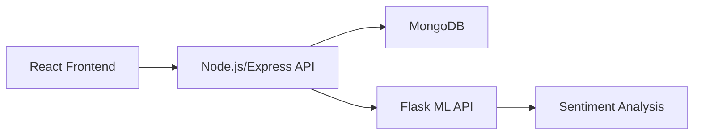

# 🧠 SentiLog AI

[](LICENSE)
[](https://github.com/openml-stack/SentiLog-AI/pulls)
[](https://github.com/openml-stack/SentiLog-AI/actions)
[](https://github.com/openml-stack/SentiLog-AI/issues)

---

## 🌟 Overview

**SentiLog AI** is a full-stack application that blends real-time news sentiment analysis with personal mood journaling. It helps users track their emotions and detect news bias using machine learning.

---

## 🔧 Tech Stack

| Layer       | Technology                    |
|-------------|-------------------------------|
| Frontend    | React, Vite, Tailwind CSS     |
| Backend     | Node.js, Express, MongoDB     |
| ML API      | Python, Flask, VaderSentiment |
| Auth        | JWT-based Authentication      |
| DB          | MongoDB Atlas (via Mongoose)  |

---

## 🗂️ Architecture



---

## 🚀 Getting Started

### 1. Clone the Repository

```bash
git clone https://github.com/openml-stack/SentiLog-AI.git
cd SentiLog-AI
```

---

### 2. Install & Run Client

```bash
cd client
npm install
npm run dev
```

---

### 3. Install & Run Server

```bash
cd ../server
npm install
cp .env.example .env
# Fill your MongoDB URI and other secrets in .env
npm run dev
```

---

### 4. Install & Run ML API

```bash
cd ../ml-api
python3 -m venv venv
source venv/bin/activate
pip install -r requirements.txt
python app.py
```

---

## 🌍 Environment Variables

Update `.env` in `server/` folder with:

```
PORT=8080
MONGODB_URI=mongodb://localhost:27017/sentilog
ML_API_URL=http://localhost:8060
JWT_SECRET=your_secret_key
```

---

## 📄 API Documentation

You can find detailed API information in [server/API_DOC.md](server/API_DOC.md), including:

- All Server and ML API endpoints
- Request/response formats
- Sample payloads
- Status codes & error handling

Additionally, the Swagger documentation is available at:

```text
http://localhost:8080/api-docs
```

---

## ✨ Features

### 📰 News Bias Filter
- Classifies articles as Left, Right, or Neutral.
- Real-time NLP-based sentiment + ideological analysis.

### 📓 Mood Journal
- Users log their mood and track emotional trends.
- Analyzed using ML-based sentiment/emotion scoring.

---

## 📁 Project Structure

```
SentiLog-AI/
├── client/           # Frontend (React)
├── server/           # Backend (Express + MongoDB)
├── ml-api/           # Python Flask ML service
├── notebook/         # Research notebooks
├── README.md
└── server/API_DOC.md # Detailed API docs
```

---

## 🧩 Contributing

1. Comment on an open issue.
2. Fork the repository.
3. Work in a feature branch.
4. Open a pull request with descriptive title.

---

## 📝 License

MIT License — see [LICENSE](./LICENSE)

---

## 🙌 Community & Support

- [Issues](https://github.com/openml-stack/SentiLog-AI/issues)
- [Discussions](https://github.com/openml-stack/SentiLog-AI/discussions)

> Let’s build the future of sentiment + media intelligence together.